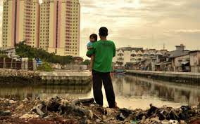

# Indonesia Poverty and Equity Program (P181107)

## Objective
For our project, we aim to explore Indonesia's development and connectivity by analyzing data sources such as AIS (shipping data), household surveys, and census information. Our goal is to identify key patterns, challenges, and opportunities for growth, focusing on how they impact the quality of life and economic fairness.

## Dataset
The data, provided by William Hutchins Seitz, spans health, education, and socio-economic statistics from villages to regencies, sourced from PODES surveys between 2011 and 2019.

## Rationale
Our project seeks to use this data to enhance living conditions by addressing disparities in health, education, and economic status across Indonesia, aiming for a more inclusive development.

## Approach
We will conduct a series of steps including data examination, merging datasets, integrating satellite data, developing maps and visuals, and creating statistical models for a comprehensive analysis.

## Timeline
The project is structured to be completed within 12 weeks, with specific milestones for each stage of the project.

## Expected Number of Students
Two students are expected to collaborate on this project.

## Possible Issues
The main challenge anticipated is managing the data's complexity, given the vast number of variables and the extensive size of the PODES survey datasets.

## Contact Information
- Advisor: Edwin Lo
- Contact: [edwinlo@email.gwu.edu](mailto:edwinlo@email.gwu.edu)

*Figure 1: An illustrative image representing the project's focus on Indonesia's development.*

